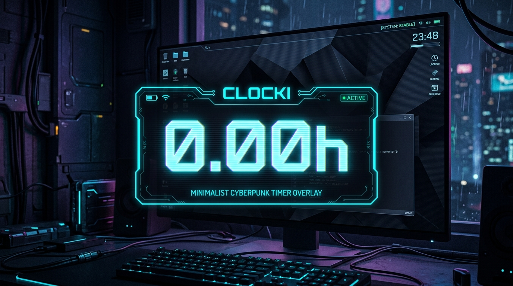
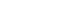

# Clocki ⏱️

> A minimalist, frameless desktop floating timer overlay for tracking daily focus hours.



<p align="center">
  
</p>


---

## Features

- **Frameless Overlay**: Compact $66 \times 24\text{px}$ floating HUD with cyberpunk cyan scanlines.
- **Always on Top**: Stays above workspaces without interrupting focus.
- **Instant Controls**:
  - **Left Click**: Pause / Resume timer.
  - **Double Click**: Reset timer to `0.00h`.
  - **Right Click**: Hide overlay window.
  - **Drag**: Click & drag anywhere on the overlay to reposition.
- **Global Hotkeys**:
  - `Ctrl+Alt+C`: Toggle pause/resume.
  - `Ctrl+Alt+H`: Show / Hide window.
  - `Ctrl+Alt+R`: Reset timer.
- **Persistence & Auto-Reset**: Automatic session logging to `~/.local/share/clocki/state.json` and automatic daily reset at midnight.

---

## Quick Start

### Prerequisites
- Node.js (v18+)
- npm

### Installation & Run

```bash
# Install dependencies
npm install

# Build TypeScript sources
npm run build

# Start overlay
./clocki.sh
```

---

## Resetting the Timer

You can reset the timer at any time using any of the following methods:
1. **Double-click** directly on the overlay timer.
2. Press **`Ctrl+Alt+R`** globally from anywhere.
3. Press **`Ctrl+R`** when the overlay is focused.
4. Launch with CLI flag: `./clocki.sh --reset`

---

## License

MIT © [Masih Moafi](https://github.com/masihmoafi)

-
